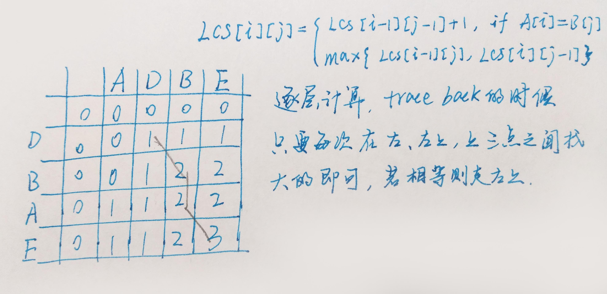

# Delete Operation for Two Strings（LCS）

_udpate Aug 4,2017 23:04_

[LeetCode](https://leetcode.com/problems/delete-operation-for-two-strings/description/)

Given two words word1 and word2, find the minimum number of steps required to make word1 and word2 the same, where in each step you can delete one character in either string.

**Example 1:**

```text
Input: "sea", "eat"
Output: 2
Explanation: You need one step to make "sea" to "ea" and another step to make "eat" to "ea".
```

**Note:** The length of given words won't exceed 500. Characters in given words can only be lower-case letters.

## Basic Idea:

这道题目其实是一个LCS问题，只要求出word1和word2的LCS，答案就是两string长度分别减去lcs长度再相加。

求LCS的方法是经典的dp，状态 `dp[i][j]` 表示 word1 的第 i 个字符以及 word2 的第 j 个字符之前的部分的最长 lcs 长度，由此我们可以得到状态转移方程：

```java
    dp[i][j] = dp[i-1][j-1]+1 if word1[i]== word2[j]
       else  max{ dp[i-1][j], dp[i][j-1] }
```



## Java Code:

```java
    // 这是一个 LCS 问题
    public class Solution {
        public int minDistance(String word1, String word2) {
            int[][] dp = new int[word1.length() + 1][word2.length() + 1];
            for (int i = 1; i < word1.length() + 1; ++i) {
                for (int j = 1; j < word2.length() + 1; ++j) {
                    if (word1.charAt(i - 1) == word2.charAt(j - 1)) dp[i][j] = dp[i - 1][j - 1] + 1;
                    else dp[i][j] = Math.max(dp[i - 1][j], dp[i][j - 1]);
                }
            }
            int lcs = dp[dp.length - 1][dp[0].length - 1];
            System.out.println(lcs);
            return word1.length() - lcs + word2.length() - lcs;
        }
    }
```

_update Nov 10, 2018_

## Update：滚动数组优化方法

先写好常规解法，然后利用取余进行优化。这样就可以轻易写出滚动数组优化space complexity。

```java
class Solution {
    public int minDistance(String word1, String word2) {
        int[][] dp = new int[2][word2.length() + 1];
        for (int i = 1; i < word1.length() + 1; ++i) {
            for (int j = 1; j < dp[0].length; ++j) {
                if (word1.charAt(i - 1) == word2.charAt(j - 1)) {
                    dp[i % 2][j] = dp[(i - 1) % 2][j - 1] + 1;
                } else {
                    dp[i % 2][j] = Math.max(dp[(i - 1) % 2][j], dp[i % 2][j - 1]);
                }
            }
        }
        return word1.length() + word2.length() - 2 * dp[word1.length() % 2][dp[0].length - 1];
    }
}
```

