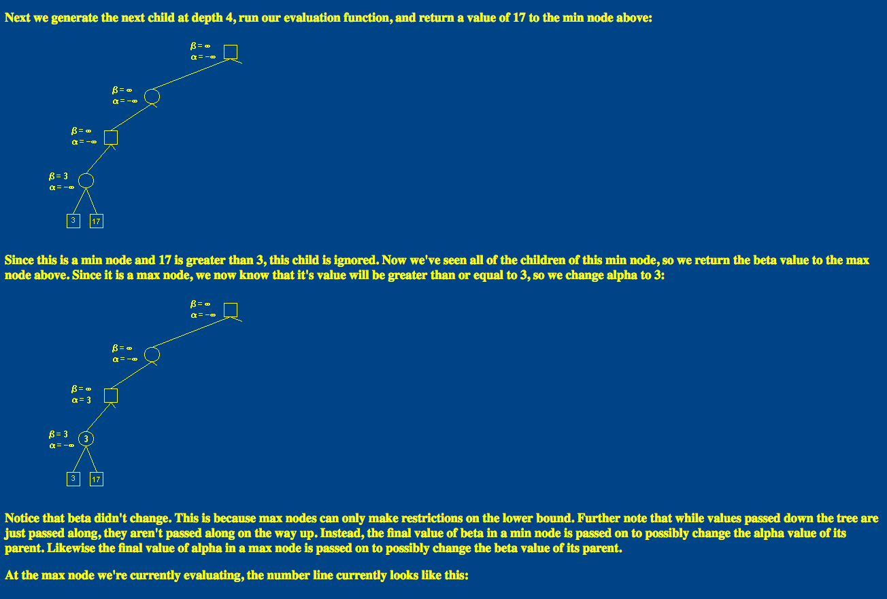
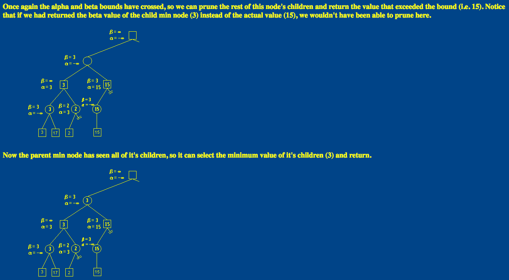

# Predict the Winner

_update Jul,30 2017 20:44_

[LeetCode](https://leetcode.com/problems/predict-the-winner/description/)

Given an array of scores that are non-negative integers. Player 1 picks one of the numbers from either end of the array followed by the player 2 and then player 1 and so on. Each time a player picks a number, that number will not be available for the next player. This continues until all the scores have been chosen. The player with the maximum score wins.

Given an array of scores, predict whether player 1 is the winner. You can assume each player plays to maximize his score.

**Example 1:**

```text
Input: [1, 5, 2]
Output: False
Explanation: Initially, player 1 can choose between 1 and 2. 
If he chooses 2 (or 1), then player 2 can choose from 1 (or 2) and 5. If player 2 chooses 5, then player 1 will be left with 1 (or 2). 
So, final score of player 1 is 1 + 2 = 3, and player 2 is 5. 
Hence, player 1 will never be the winner and you need to return False.
```

**Example 2:**

```text
Input: [1, 5, 233, 7]
Output: True
Explanation: Player 1 first chooses 1. Then player 2 have to choose between 5 and 7. 
No matter which number player 2 choose, player 1 can choose 233.
Finally, player 1 has more score (234) than player 2 (12), so you need to return True representing player1 can win.
```

**Note:**

* 1 `<=` length of the array &lt;= 20.
* Any scores in the given array are non-negative integers and will not exceed 10,000,000.
* If the scores of both players are equal, then player 1 is still the winner.

## Basic Idea:

[**这里**](https://liuqinh2s.gitbooks.io/leetcode/content/中文版/第一遍/486.%20Predict%20the%20Winner.html)是一个很好的分析文章，讲了使用minMax方法的思路。 [**这里**](http://web.cs.ucla.edu/~rosen/161/notes/alphabeta.html) 是ucla关于Alpha-Beta 剪枝算法的讲义，非常好。

**先概括说一下思路** 这道题目属于一个双方博弈的零和问题，可以使用博弈树模型来理解其过程。最intuitive的解法是用minMax算法recursively地对双方依次计算所有的下一个状态，并为双方取所有结果可能的最大值，最终再比较两方player1 和 player2 的最大值。代码如下：

```java
    // min-max algo
    // 基础版本
    public class Solution {
        private boolean P1 = true;
        private boolean P2 = false;
        public boolean PredictTheWinner(int[] nums) {
            int[] scores = minMax(nums, 0, nums.length - 1, P1);
            return scores[0] >= scores[1];
        }
        // 首先需要定义结果的评分标准
        // p1, p2 分别统计分数，最终再对比, p1 的分数存入 scores[0], p2 scores[1]
        private int[] minMax(int[] nums, int start, int end, boolean player) {
            int[] scores = new int[2];
            if (start == end) { // 出口
                if (player == P1) scores[0] = nums[start];
                else scores[1] = nums[start];
                return scores;
            }
            if (player == P1) {
                int[] s1 = minMax(nums, start + 1, end, P2);
                s1[0] += nums[start];
                int[] s2 = minMax(nums, start, end - 1, P2);
                s2[0] += nums[end];
                return s1[0] > s2[0] ? s1 : s2;
            } else {
                int[] s1 = minMax(nums, start + 1, end, P1);
                s1[1] += nums[start];
                int[] s2 = minMax(nums, start, end - 1, P1);
                s2[1] += nums[end];
                return s1[1] > s2[1] ? s1 : s2;
            }
        }
    }
```

我们觉得上面的代码太复杂，想到：player 1 获胜就是 `player1.score > player2.score` 也就是 `player1.score - player2.score > 0`，基于这种思路，我们可以给整个局势的结果统一制定评分标准，就是总分大于等于0，则player1获胜。每次player1的得分记为正数，player2 的分数则为负数。然后用一个 `int player` 来标注，1 表示 player1，-1 表示 player2. 代码如下：

```java
    // 优化版本recursion 博弈树
    // 不再分别为p1 p2统计分数，而是统计总分(p1.score - p2.score).
    // 这样一来，p2 得分贡献为负值，p1 为正值，就无需分别考虑，利用 1 来表示 p1,
    // -1 表示 p2， 只要分数乘上这个值就可以了
    // 这也就是 negaMax 的方法
    public class Solution {
        private int stepCount = 1;
        public boolean PredictTheWinner(int[] nums) {
            boolean ret = minMax(nums, 0, nums.length - 1, 1) >= 0;
            System.out.println(stepCount);
            return ret;
        }
        private int minMax(int[] nums, int start, int end, int player) {
            stepCount++;
            if (start == end) return nums[start] * player; 
            // select left
            int s1 = nums[start] * player +  minMax(nums, start + 1, end, -player);
            // select right
            int s2 = nums[end] * player + minMax(nums, start, end - 1, -player);
            if (player == 1) {
                // 如果是 1，选择最大分数
                return Math.max(s1, s2);
            } else {
                // 如果是2，选择最小值
                return Math.min(s1, s2);
            }
        }
    }
```

接下来，我们还可以应用 **Alpha-Beta Pruning** 算法对上面的negaMax进行优化。详见前面的链接。 在这里，我们对 minMax\(\) 函数传入每层选择的数字，这样到了出口我们就会知道这条path的总分，进而进行剪枝就会变得方便。 !![!\[\]\(/assets/Screen Shot 2017-08-01 at 10.45.45 PM.pn](../../.gitbook/assets/Screen%20Shot%202017-08-01%20at%2010.45.59%20PM.png)g\) Java 代码如下：

```java
    // 使用 Alpha-Beta剪枝 算法优化上面的negaMax算法
    // alpha 为lower bound，beta 为upper bound
    public class Solution {
        private int stepCount = 1;
        public boolean PredictTheWinner(int[] nums) {
            int ret = minMax(nums, 0, nums.length - 1, 0, Integer.MIN_VALUE, Integer.MAX_VALUE, 1);
            System.out.println(stepCount);
            return ret >= 0;
        }
        private int minMax(int[] nums, int start, int end, int path, 
                           int alpha, int beta, int player) {
            stepCount++;
            if (start > end) return path;
            // go left
            int s1 = minMax(nums, start + 1, end, path + player * nums[start], alpha, beta, -player);

            // alpha beta 剪枝
            if (player == 1) { 
                // max node, 如果大于upper bound beta 则剪
                if (s1 > beta) return s1;
                // 如果不大于，则更新lower bound alpha，然后算下一个node
                alpha = Math.max(alpha, s1);
            } else {
                if (s1 < alpha) return s1;
                beta = Math.min(beta, s1);
            }

            // go right
            int s2 = minMax(nums, start, end - 1, path + player * nums[end], alpha, beta, -player);

            // 选取总分最大的返回
            return player * Math.max(player * s1, player * s2);
        }
    }
```

Python Code:

```python
    # nega-max Alpha-Beta pruning algorithm
    class Solution(object):
        def PredictTheWinner(self, nums):
            """
            :type nums: List[int]
            :rtype: bool
            """
            if len(nums) % 2 == 0: return True
            self.count = 0
            ret = self.minMax(nums, 0, len(nums) - 1, 0, float('-INF'), float('INF'), True) >= 0
            print self.count
            return ret

        # alpha: lower bound of min node, beta: upper bound of max node
        def minMax(self, nums, start, end, currScore, alpha, beta, player1):
            self.count += 1
            if player1: 
                # max node
                if start > end:
                    return currScore
                left = self.minMax(nums, start + 1, end, currScore + nums[start], alpha, beta, False)

            # pruning
                if left > beta:
                    return left  # 注意这里返回left，而不是beta
                alpha = max(alpha, left)

                right = self.minMax(nums, start, end - 1, currScore + nums[end], alpha, beta, False)
                return max(left, right)
            else:
                # min node
                if start > end:
                    return currScore
                left = self.minMax(nums, start + 1, end, currScore - nums[start], alpha, beta, True)

            # pruning
                if left < alpha:
                    return left  # 同理
                beta = min(left, beta)

                right = self.minMax(nums, start, end - 1, currScore - nums[end], alpha, beta, True)
                return min(left, right)
```

**经过测试：** 应用Alpha-Beta Pruning 之后，时间复杂度变为普通minMax的多项式低阶。而根据wiki，平均应为普通minMax方法的 3/4 次方。比较符合。

## Dp Solution:

最快的方法还是使用memoization，避免了大量的重复工作，将时间复杂度缩减到O\(n^2\)。

**解释：** 可以这样理解，这里的dfs函数的定义为：

```java
    // 进一步简化，不再区分 p1 p2，并且使用memoization
    // 还是利用在p2的局，将其得分定为负数
    // table 使用Integer[][] 因为可以初始化为null
    public class Solution {
        private int stepCount = 1;
        public boolean PredictTheWinner(int[] nums) {
            Integer[][] table = new Integer[nums.length][nums.length];
            int ret = dfs(nums, 0, nums.length - 1, table);
            System.out.println(stepCount);
            return ret >= 0;
        }
        private int dfs(int[] nums, int start, int end, Integer[][] table) {
            if (table[start][end] != null) return table[start][end];
            stepCount++;
            if (start == end) {
                return nums[start];
            }
            int a = nums[start] - dfs(nums, start + 1, end, table);
            int b = nums[end] - dfs(nums, start, end - 1, table);
            int score = Math.max(a, b);
            table[start][end] = score;
            return score;
        }
    }
```

