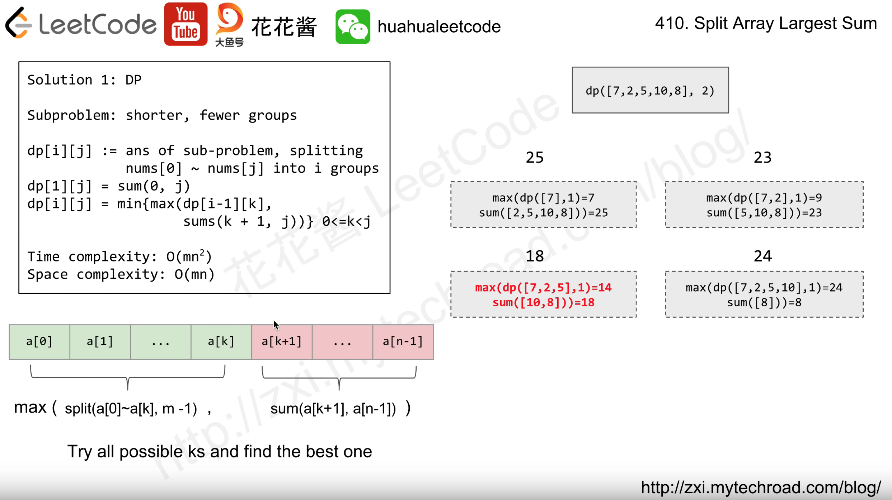

# 410 Split Array Largest Sum

_update 2018-10-12 13:40:38_

[leetCode](https://leetcode.com/problems/split-array-largest-sum/description/)

Given an array which consists of non-negative integers and an integer m, you can split the array into m non-empty continuous subarrays. Write an algorithm to minimize the largest sum among these m subarrays.

**Note:**  
If n is the length of array, assume the following constraints are satisfied:

1. `1 ≤ n ≤ 1000`
2. `1 ≤ m ≤ min(50, n)`

**Examples:**

```text
Input:
nums = [7,2,5,10,8]
m = 2

Output:
18
```

**Explanation:**

1. There are four ways to split nums into two subarrays.
2. The best way is to split it into `[7,2,5]` and `[10,8]`,
3. where the largest sum among the two subarrays is only 18.

## Basic Idea:

这道题目的DP解法确实不容易想到，但这种解法本身是不难理解的。这个问题本质是求：`将给定长度为n的数组分成m段subarray，使得所有subarray中sum的最大值最小`，于是我们可以定义子问题：`将长度为n-k的数组分成m-1段，使所有subarray中sum的最大值最小`。然后我们发现可以由子问题推出下一层的解，这就符合了DP求解一个问题的规律。

发现youtube上有一个花花酱的视频，个人感觉讲得不错，看这个截图就可以理解了：



这个做法的时间复杂度为 `O(m*n^2)`;

* **Java Code:**

  ```java
  class Solution {
      public int splitArray(int[] nums, int m) {
          int[] prefixSum = new int[nums.length + 1];
          for (int i = 0; i < nums.length; ++i) {
              prefixSum[i + 1] = prefixSum[i] + nums[i];
          }
          int[][] dp = new int[m + 1][nums.length + 1];
          for (int i = 1; i < nums.length + 1; ++i) {
              dp[1][i] = prefixSum[i];
          }
          for (int i = 2; i <= m; ++i) {
              for (int j = 1; j <= nums.length; ++j) {
                  int minSum = Integer.MAX_VALUE;
                  for (int k = 1; k < j; ++k) {
                      minSum = Math.min(minSum, Math.max(dp[i - 1][k], prefixSum[j] - prefixSum[k]));
                  }
                  dp[i][j] = minSum;
              }
          }
          return dp[m][nums.length];
      }
  }
  ```

