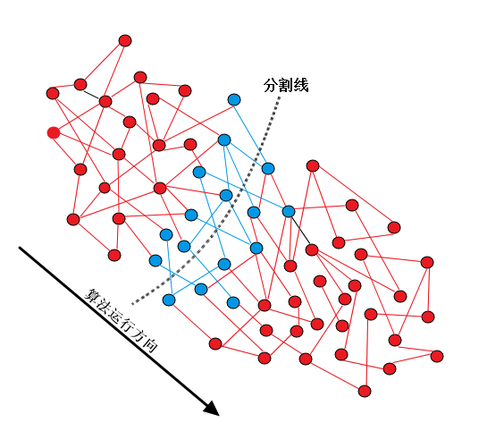

# 关于最短路径算法的一些想法

_update Jan 6, 2018 0:20_

【1】 **首先贴一个非常好的博客：**[**here**](https://61mon.com/index.php/archives/195/)**, 其中系统比较了几种SSSP算法, 这里的很多观点会来自这个博客。**  
【2】 **还有这个：**[**here**](http://www.cnblogs.com/AndreMouche/archive/2011/03/29/1998824.html)**，其中描述了一种非常简单但是很有效的 Bellman-Ford 算法的优化方法；**

### 关于 Bellman-Ford Algorithm

**Bellman-Ford 的局限：**  
  Bellman-Ford 算法是执行 `relax all edges for |V|-1 times`，时间复杂度为 O\(\|VE\|\)。它的效率低下主要由于以下两个问题：

1. 对于已经确定了最小距离的 vertex，所有对它的入边的 relax 都没有意义，因为它们不会改变该 vertex 的距离（已经最小了）；
2. 只有对于其与 start vertex 的最小距离已经确定的起始点的出边的 relax 是有意义的，而其余的 relax 注定还需要被再次 relax；
3. 当某次外层循环\(`for i in range(number of V)`\)中没有一条边被 relax时，我们就可以认为整个Bellman-Ford已经结束，可以提前退出，而不必要做满 `|v|-1` 次；

如图：  
    
分割线以左为已经确定最短距离的点。我们可以看到，左上方红色部分表示因为 `原因 1` 所带来的无用功，右下方的红色部分为 `原因 2` 带来的无用功。

事实上，Dijkstra 算法同时解决了这两个问题，原因如下：

> Dijkstra 算法中，每次 pq 中 poll 出的元素都是最终确定最短路径后的元素。接下来考虑 relax 的边都是已经确定最短路径的 vertex 的出边，所以上图中右下方红色部分不会出现；  
>   另外，因为已经确定了最小距离的 vertex 会被出队，基本上避免了左上方红色部分。所以 Dijkstra 真的是很优秀的算法。

而下面提到的 SPFA 算法也在这两点上进行了优化：

> 首先，queue 中的 vertex 都是刚刚被更新过 distance 的点。已经获得最小距离的 vertex 在出队之后不会再次 enqueue，因此避免了图中左上的红色部分；  
>   其次，每个 vertex 从进入队尾到其出队会经历比较长的时间，在这段时间内如果其 distance 被更新，它不会很快被visit，这一特点一定程度上减少了右下方红色部分的产生；

**关于负权边和负权回路：**  
  Bellman-Ford 的优点是可以处理负权重边，以及判断图中是否有负权回路，判断方法是执行过n-1次之后，再多执行一次，如果发现仍然有边可以被 relax，则说明有负权回路，并且该边就是负权的入口。

### 基于上面 `局限 3` 的简单优化

这个优化方案来自 `Ref[2]`。我们在循环的过程中，每次用一个 flag 记录在当前次外层循环中是否有边被 relax，如果没有，则提前退出。

这样简单的优化却带来了意想不到的结果：

```python
    1.13|E|, if |E|<|V|
    0.95*|E|*lg|V|, if |E|>|V|
```

几乎赶上了堆优化的 Dijkstra，可以说是非常优秀。不过当存在负权回路的时候，还是需要 O\(VE\) 的时间才能 detect 出负权回路。

### SPFA 算法，Queue Based Bellman-Ford Algorithm

SPFA\(Shortest Path Faster Algorithm\) 是由西南交大的段凡丁在上世纪九十年代提出的，它旨在通过使用一个 FIFO 的 queue 来对 Bellman Ford 算法进行优化，最终将时间复杂度控制在 `O(k * E)`, 其中 k 是每个vertex的平均入队次数，在 sparse graph 中一般小于 2，而在 dense graph 中不稳定。

**实现方法：**  
  在Bellman-Ford的基础上，维持一个queue用来存放接下来需要visit的点（这里的visit指的是relax它的出边）。每次取出 peek 的元素 u，relax 它所有的出边 `(u,v)`，如果 v 的距离变得更小，且 v 不在 queue 中，则将其加入 queue 中，等待之后更新它的 neighbors。直到队列为空。

  判断一个 vertex 是否在 queue 中，可以另外维护一个 `boolean[] visited`，每次 poll 出队首之后令其 visited 中对应值变为 false，enqueue 后则变为 true；

**如何处理负权回路：**  
  如果一个 vertex 的总入队次数超过 `|V|`，则说明有负权回路；证明方法在前面所附的 reference 中有；

**优化：**  
另外，SPFA 算法有两个优化策略：SLF 和 LLL。

1. SLF，Small Label First 策略，设要加入的节点是 j，队首元素为 i，若dist\[j\] &lt; dist\[i\]，则将 j 插入队首，否则插入队尾；
2. LLL，Large Label Last 策略，设队首元素为 i，队列中所有 dist 值的平均值为 x，若dist\[i\] &gt; x则将 i 插入到队尾，查找下一元素，直到找到某一 i 使得dist\[i\] &lt;= x，则将 i 出队进行松弛操作。

SLF 可使速度提高 15 ~ 20%，SLF + LLL 可提高约 50%。 但这两个优化本身是需要额外的复杂度的，甚至可能需要重新设计一套数据结构，来高效完成队首与队尾的插入。

## 总结：

1. 如果是 non-negative weight，可以采用 Dijkstra，时间复杂度比较好 \(O\(ElogV\)\);
2. 如果可能存在负权回路，可以用优化版Bellman-Ford进行判断；
3. 如果有 negative edge 而没有负权回路，可以用 SPFA;
