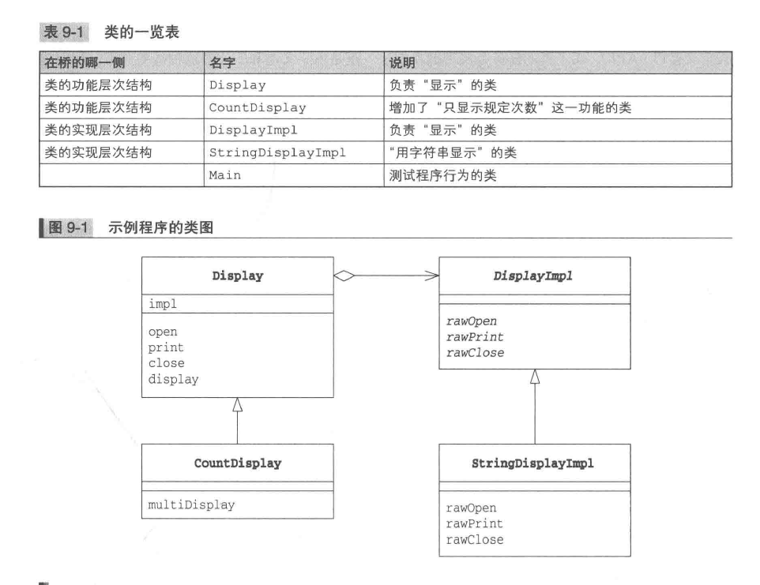
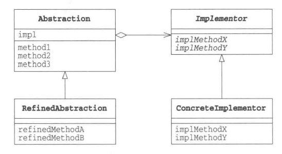

# Bridge Pattern
_update Oct 29, 2019_

--

## 1. Introduction
Bridge 起到桥梁作用，用来连接类的**功能层次结构**和**实现层次结构**。

### i. 类的层次结构的两个作用
1. **希望增加新功能时**
  > 假设有一个类 Something，当我们想要在 Something 中增加新功能时（想增加一个具体方法），会编写一个Something类的子类，即SomethingGood类，这样就有了一个类的层次结构：
  > ```
  > Something
  >      |
  >      |--SomethingGood
  > ```
  > 这就是为了增加新功能而产生的层次结构。父类具有基本功能，在子类中增加新的功能。  
  > 如果我们想要在 SomethingGood 的基础上增加新的功能，我们可以同样编写一个 SomethigBetter类，这样层次结构就更深了：
  > ```
  > Something
  >    |
  >    |--SomethingGood
  >            |
  >            |--SomethingBetter
  > ```
  > 通常来说，类的层次结构不易过深。

2. **希望增加新实现时**
> 在 Template Method 模式讲了抽象类的作用，抽象类声明了一些方法，定义了一些API，然后由子类负责去实现这些抽象方法。父类的任务是通过声明抽象方法的方式定义API，子类的任务是实现抽象方法，这样我们才能编写出具有高可替换性的类。</br>
> 这里其实也可以存在层次结构，例如，当子类 ConcreteClass 实现了父类 AbstractClass 类的抽象方法时，他们之间就构成了一个层次结构：
> ```
>  AbstractClass
>      |
>      |--ConcreteClass
> ```
> 但是这里的类的层次结构并非用于增加新功能，它真正的作用是实现上面所说的父类和子类不同的任务分组，这就是类的实现层次结构。当我们想要以其它方式实现AbstractClass时，例如要实现一个 AnotherConcreteClass 时，类的层次结构会发生一些变化：
> ```
> AbstractClass
>      |
>      |--ConcreteClass
>      |
>      |--AnotherConcreteClass
> ```

### ii. 类的层次结构混杂与分离
由于有了两种不同的层次结构的考虑，当我们要编写子类的时候就需要先确认自己的意图：**是要增加功能，还是要增加实现**。当层次结构只有一层时，功能层次结构和实现称此结构是混杂在一个层次中的，很容易使层次结构变得复杂，也很难透彻理解，因为自己难以确定究竟应该在类的哪一个层次结构中增加子类。  

因此我们需要将 “类的功能层次结构” 和 “类的实现层次结构” 分离为**两个独立的类层次结构**。但如果简单将其分开，两者之间就会缺少联系，于是我们需要在他们之间搭一座桥梁，这就是所谓的 Bridge Pattern.

## 2. Example


### i. 类的功能层次结构：
**Display** 类是抽象的，负责“显示一些东西”，该类位于“功能层次”的最上层。**impl** 字段中保存的是实现Display具体功能的实例。该实例通过构造函数传给Display类，然后保存在impl中，这里的impl其实就是所谓的bridge。

  ```java
    public class Display {
        private DisplayImpl impl;
        public Display(DisplayImpl impl) {
            this.impl = impl;
        }
        public void open() {
            impl.rawOpen();
        }
        public void print() {
            impl.rawPrint();
        }
        public void close() {
            impl.rawClose();
        }
        public final void display() {
            open();
            print();
            close();
        }
    }
  ```

**CountDisplay** 类在 Display 类的基础上增加了一个新功能 multiDisplay 方法，该类继承了 Display 的方法，并用他们来实现这个新方法。我们通过继承 Display 并添加新方法给Display添加了新的功能，这就是 “类的功能层次结构”。
  ```java
    public class CountDisplay extends Display {
        super(impl);
    }
    public void multiDisplay(int times) {
        open();
        for (int i = 0; i < times; ++i>) {
            print();
        }
        close();
    }
  ```

### ii. 类的实现层次结构
**DisplayImpl** 类是抽象类，声明了 `rawOpen(), rawPrint(), rawClose()` 三个抽象方法：
  ```java
    public abstract class DisplayImpl {
        public abstract void rawOpen();
        public abstract void rawPrint();
        public abstract void rawClose();
    }
  ```
**StringDisplayImpl** 类则是真正的“实现类”，它继承了 DisplayImpl 类并且实现了父类中的抽象方法。这样 DsiplayImpl 和 StringDisplayImpl 就构成了 “类的实现层次结构”，将来如果我们想要增加或者替换其他的实现类，只需要让新的类也继承 DisplayImpl 类即可。

### iii. 使用
在 **Main** 类中，我们可以新建 Display 或者 CountDisplay 的实例，这样就可以有不同的功能，而它们内部都保存有 DisplayImpl 类型的字段，其中保存的是 StringDisplayImpl 的实例。
  ```java
    public class Main {
        public static void main(String[] args) {
            Display d1 = new Display(new StringDisplayImpl("Hello, China."));
            Display d2 = new CountDisplay(new StringDisplayImpl("Hello, World"));
            CountDisplay d3 = new CountDisplay(new StringDisplayImpl("Hello, Universe"));
            d1.display();
            d2.display();
            d3.display();
            d3.multiDisplay(5);
        }
    }
  ```

## 3. Bridge Pattern 中登场的角色
1. Abstraction
  > 该角色位于 “类的功能层次结构” 最上层，它定义了基本功能，使用 Implementor 角色中的方法。该角色保存了 Implementor 角色的实例。在例子中，由 Display 类扮演。
2. RefinedAbstraction
  > 在 Abstraction 中增加新的功能的角色。在例子中由 CountDisplay 类扮演。
3. Implementor
  > 位于 “类的实现层次结构” 最上层，定义了用于实现 Abstract 角色的 API。在例子中由 DisplayImpl 扮演。
4. ConcreteImplementor
  > 该角色负责实现 Implementor 角色中定义的API。在例子中由StringDisplayImpl扮演。



## 4. 思路拓展
1. 分开后更容易拓展
  > &nbsp;&nbsp;&nbsp;&nbsp; 模式将类的 “功能层次结构”和“实现层次结构” 分离开，有利于独立对它们进行扩展。当想要增加新功能时候只需要在功能层次一侧增加类，而且新增加对功能类可以直接兼容“所有的实现“。  
  > &nbsp;&nbsp;&nbsp;&nbsp; 例如，我们可以将某程序中依赖于不同操作系统的部分分为 "linux", "windows", "mac" 版，然后我们就可以用 Bridge 模式中的 “类的实现结构层次” 来表现这些依赖于操作系统的部分。这样我们只要编写一个定义这些操作系统的公共API的 Implementor 角色，然后写不同操作系统版本的 ConcreteImplementor 角色就可以了。
2. 继承是强关联，委托是弱关联
  > &nbsp;&nbsp;&nbsp;&nbsp; 虽然继承很容易扩展类，但会在类之间形成一种强关联的关系，即 compile time binding，不修改 code 就没办法修改这种关系。这时我们可以使用 “委托delegation” 来代替继承。例子中的 Display 中使用了“委托” impl，当调用 `open()` 时候会调用 `impl.rawOpen()`，这样就实现了委托。  
  > &nbsp;&nbsp;&nbsp;&nbsp; 之所以称 ”委托delegation“ 为弱相关关系，是因为只有在 Display 类的实例生成时候才会产生 binding，我们可以不传入 `ConcreteImpl_1` 的实例而是传入 `ConcreteImpl_2` 的实例。这时发生变化的代码只有 Main 类，Display 和 DisplayImpl 则不需要修改。

## 5. 相关设计模式
1. Template Method 模式
  > Template Method 中使用了 “类的实现层次结构”，父类调用抽象方法，而子类实现抽象方法。
2. Abstract Factory 模式
  > 为了根据需求设计出良好的 ConcreteImplementor 角色，我们有时会使用 Abstract Factory。
3. Adapter 模式
  > 使用Bridge可以达到分离实现层次和共功能层次，并将这些层次结合起来。而Adapter模式则可以结合功能相似但接口不同的类。
