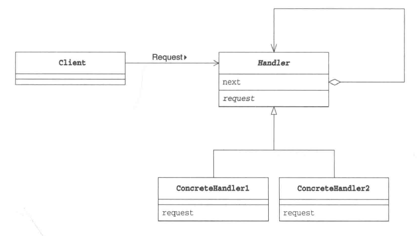

# Chain of Responsibility

_update Mar 25, 2020_

## 1. Introduction

为了解耦一个request的sender和handler之间的关系，我们可以使用责任链模式。简单来说这个模式就是将多个handler练成一个chain，然后由client将request发给这个chain，之后从头开始一次尝试每一个handler直到最终完成处理。

## 2. Problem

当我们遇到一些对于request存在较为复杂的处理方法，尤其是存在分级处理结构的时候，如果我们将处理流程写在同一个类中，就不可避免要使用许多 `if ... eles ...` 来将多种处理分类。但是这样做存在很多问题，例如这个负责handle request的类会过于复杂，甚至有了多种处理具体的逻辑，违反了Single Responsibility Principle，而且将来需要增加新的处理流程就需要更改这个类，违反了 Open/Closed Principle。

## 3. Structure

Handler是所有handler的基类，其中保存有一个自身类型的instance next，表示责任链上的下一个handler，以及一个request方法用以处理request。当责任链收到request时，会依照其中存储的handler chain的顺序一次尝试处理request，按照需求选择是否需要将request pass给下一级handler。

## 4. 总结

* **1）纯与不纯的责任链**

  如果一个具体handler只能选择承担全部责任或者将request传给下一层，不允许处理一部分之后再传给下家继续处理，那么这个就是纯的责任链。相反的，如果允许某个request被一个handler处理之后再传给下家继续处理，则是不纯的责任链。

* **2）优点**
* 可以降低系统的耦合度。只需要知道request会被处理，而不需要知道具体的谁来处理specific reqeust。
* 可以动态改变责任链。
* 可以使代码更加清晰，因为每个handler只需要关注自己的工作，如果自己无法处理，只要将reqeust交给下一个handler。
* **3）缺点**
* 对于较长的责任链，系统性能可能会受到影响，而且难以debug
* 可能由于配置错误导致责任链循环调用

## 5. 相关设计模式

1. Composite 模式

   > Handler 角色经常需要使用Composite模式来存储next handler

2. Command 模式

   > 可以用Command模式向handler角色发送request

