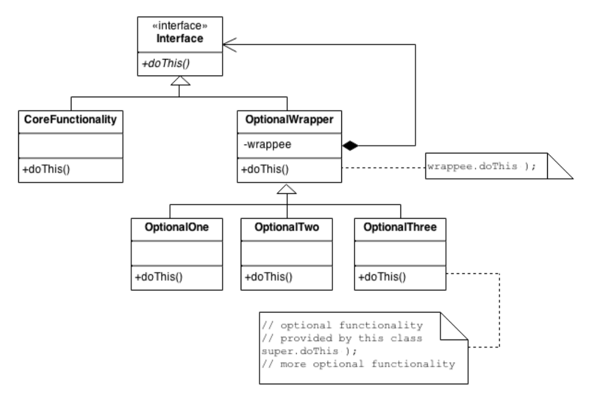
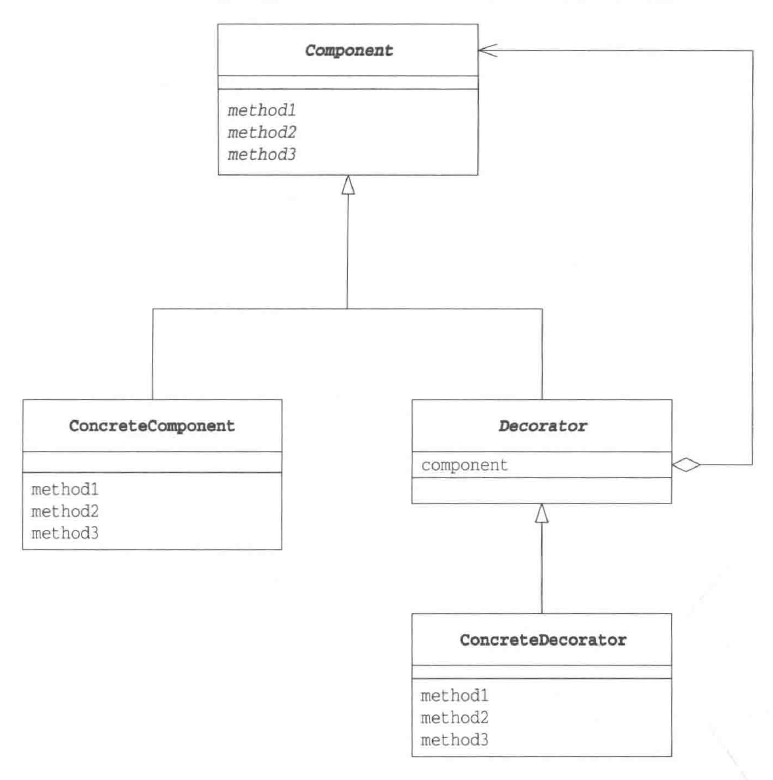

# Decorator Pattern
_update Mar 14, 2020_

---
## 1. Introduction
为了在现有的类或者方法的基础上增加新的behavior或者responsibility，我们有几种选择，其一便是通过继承现有的类，然后override其中的方法，在调用`super.thisMethod`前后增加新的behavior。但是这种做法是具有强耦合性的，无法在runtime改变，而且也无法根据需要叠加多种不同的extra behavior。如果我们需要在runtime实现上述需求，就需要要用到这里的 Decorator Pattern。

具体的，Decorator class 是一个继承了被装饰 class 的接口的类，于是在其他类看来，这个Decorator类的instance是可以被当作原来的类的instance使用的。而在这个Decorator class的实现中，我们并不是依靠super来直接调用方法，而是通过在Decorator wrapper class中保存一个Wrappee class的instance，然后通过delegation的方法来调用原本的方法，而在其前后，就可以为之增加新的behavior。这样做的好处是允许我们可以叠加多层Decorator，并且可以在runtime改变decorator的选择。

## 2. 实现思路


在通常的实现中，一般我们需要一个“Lowest Common Denominator class（wrapper和wrappee公共的interface，用来定义client需要调用的接口）”，再加上一个 Decorator 的 base class，用来支持更多不同behavior的具体decorator。

在上图中，client需要调用CoreFunctionality的doThis方法，所以需要在最上层公用Interface（Interface CommonInterface）中加入该方法，并且另OptionalWrapper继承该公共interface。在每个具体的wrapper中，提供具体的实现，而对于原本doThis方法的调用则通过wrapper中的member `CommonInterface wrappee`来delegate。下面举例说明client可能会如何使用上述结构：
```java
class Client {
    void main() {
        // get wrappee, 实际需要使用的类
        CommonInterface wrappee =  new CoreFunctionality();
        // apply OptionOne decorator and OptionTwo decorator
        CommonInterface wrappee = new OptionTwo(new OptionOne(wrappee)); // 注意这里，可以叠加多个decorator， share 相同的一个wrappee instance
        // 调用 doThis 方法，这里OptionTwo的doThis是最外层，然后是OptionOne的，最后才会调用wrappee的doThis
        wrappee.doThis();
    }
}
```

## 3. Decorator Pattern 中的角色


1. **Component:**<br> 被装饰物的接口，核心角色，也就是最上层的CommonInterface。
2. **ConcreteComponent:**<br> 实现了Component接口的具体的被装饰物的实现，也就是上面的CoreFunctionality。
3. **Decorator:**<br> 装饰器接口，该接口需要继承自Component接口，在其内部保存被装饰对象的instance，也就是上面的OptionalWrapper。
4. **ConcreteDecorator:**<br> 具体的Decorator角色，也就是上面的OptionOne/Two/Three。


## 4. 拓展思路要点
* ### 1. API的透明性
类似于Composite Pattern，这里的Decorator和Wrappee具有一致性。具体来说，Decorator是Component接口的子类，这就体现了他们的一致性，也就是说Decorator和Component具有相同的接口，这样即使Wrappee被Decorator装饰起来了，接口Component也并不会被隐藏，其中的方法依然可以被调用，这就是接口的“透明性”。
<br><br>
而得益于接口的透明性，Decorator模式也可以形成类似于Composite中的递归结构，也就是说decorator中的Wrappee也可以是另一个decorator的instance，但他们的目的是不同的。

* ### 2. 在不改变被装饰物的前提下增加新功能
Decorator模式利用了Delegation委托，从而使得我们可以在不改变wrappee的前提下为之添加新的功能。

* ### 3. 可以动态增加新的功能
同样因为Decorator中使用了Delegation，使Decorator类和ConcreteComponent之间是一种弱关联的关系，我们可以在runtime决定使用哪些Decorator对wrappee进行装饰。

* ### 4. `Java.io` 包与 Decorator 模式
首先可以生成一个读取文件的instance：
```java
Reader reader = new FileReader("datafile.txt");
```
然后，可以在读取文件时将文件内容放入buffer：
```java
Reader reader = new LineNumberReader(
                    new BufferReader(
                        new FileReader("datafile.txt")));
```
这里的LineNumberReader以及BufferReader都可以接受Reader类的instance，他们事实上就是Decorator。

* ### 5. 导致增加了许多很小的类
Decorator 模式的一个缺点是会导致程序中增加许多功能类似的很小的类.

## 5. 延伸阅读：继承和委托中的一致性（the consistency of Inheritance and Delegation）
* ### 1. 继承--父类和子类的一致性
如果继承了父类，则子类的instance可以保存在parent类的type中，也可以调用从parent继承的方法。但反过来如果想将parent类的变量当child类操作，则需要先进行类型转换。
* ### 2. 委托--自己和被委托对象的一致性
如果两个类实现了同样的interface，可以通过在其中一个类中存有另一个类的instance来实现一致性，这也是composite和decorator模式中的做法。这样做可以使得两个类的关系变为弱耦合，可以在runtime binding之间的关系。
