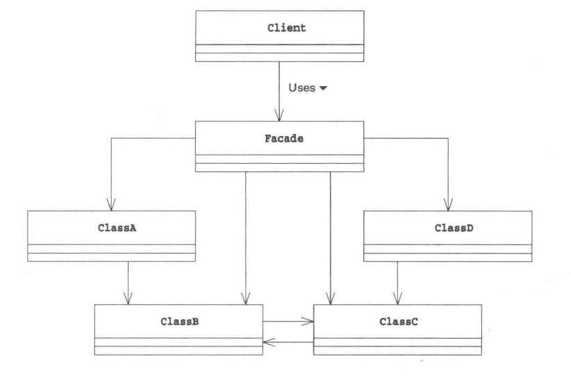

# Facade Pattern

_update Mar 25, 2020_

## 1. Introduction

Facade来自法语单词，表示一个建筑物的正面。这个模式可以为一个子系统的多个interface提供一个higher-level的易用的interface。一般来讲，就是使用一个Wrapper class来封装较为复杂的子系统，而暴露出简洁易用的接口供client调用，在其内部往往使用composite和delegate。

如上图所示，Facade的存在是为了简化client对整个subsystem的调用关系，从而降低耦合，使整个系统结构更加清晰。

## 2. 拓展思路

* **1）Facade角色到底在干什么**

  Facade可以使接口变少，弱化组件之间的联系，使得组件更容易被复用。设计类时我们需要考虑方法的可见性，同样在设计类的时候我们也需要考虑类的可见性。Facade可以减少需要被暴露的类。

* **2）递归地使用Facade**

  如果系统非常大，我们可能需要使用Facade来为多个已经使用过Facade的subsystem提供接口，也就是递归使用。

## 3. 相关设计模式

1. Abstract Factory Pattern

   > 可以讲Abstract Factory看作声称复杂instance时的Facade模式，因为它提供了“生成实力”的简单接口

2. Singleton Pattern

   > 有时候会使用Singleton模式创建Facade角色

3. Mediator Pattern

   > Facade模式单方面使用其他类来提供更high level的接口，而Mediator作为仲裁者在不同Collegue角色中间调停，是双向的。

