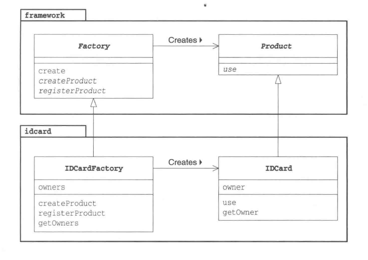
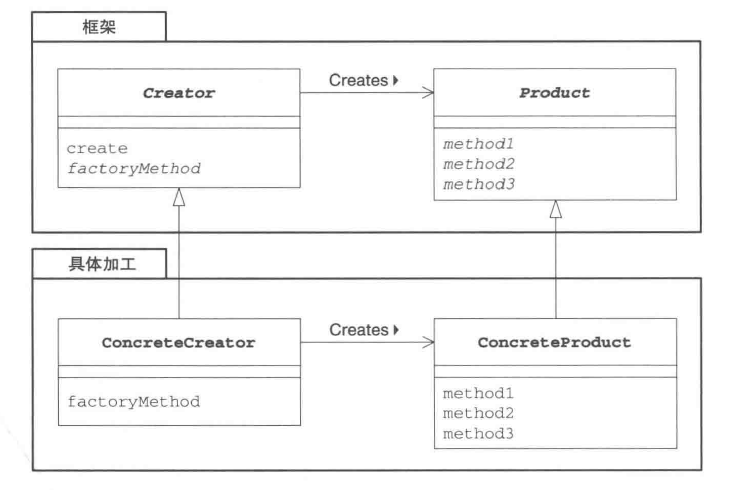

# Factory Method Pattern

_update Oct 23, 2019_

## 1. Introduction

在 Template Method 中，在父类中规定处理流程，在子类中提供每个步骤的具体实现。我们将该模式用于生成instance，就演变为了这里的 Factory Method Pattern.

在 Factory Method 模式中，父类决定生成实例的方式，但并不决定要生成的具体类，具体处理交给子类。这样就可以将生成实例的框架（framework）和实际负责生成实例的类解耦。

## 2. 举例



```java
package framework;

public abstract class Factory {
    // create, Template Method Pattern
    public final Product create(String owner) {
        Product p = createProduct(owner);
        registerProduct(p);
        return p;
    }
    // 每个步骤具体实现交给子类
    protected abstract Product createProduct(String owner);
    protected abstract void registerProduct(Product product);
}
```

```java
import famework.*;
import idcard.*;

public class Main {
    public static void main(String[] args) {
        Factory factory = new IDCardFactory();
        Product card1 = factory.create("xiaoming");
        Product card2 = factory.create("xiaohong");
        card1.use();
        card2.use();
    }
}
```

假设我们又一个用来生成 idcard instance 的框架。每个 idcard 都继承自 Product class，需要实现use方法。而对于 Factory，createProduct 方法是具体生成 instance 的抽象方法，需要由继承 Factory Class 的 subclass 实现。而 `create` 方法是 Factory 的 template method，在其中实现了生成一个 Product 所需要的通用逻辑，在这里，我们需要在 create 方法中调用 registerProduct。registerProduct 也需要由 subclass 实现。

可以看到这里其实应用了 Template Method 模式，我们在父类 Factory 的 `create` 中实现了生成Product的逻辑，而在 subclass IDCardFactory 中实现每个步骤的具体操作（`createProduct, registerProduct`）。

另外需要注意 framework 和 idcard 是属于不同的包的，这也更加接近实际工作中面对的code。用于生成实例的代码往往是框架提供，而类似于 idcard 之类具体的类则是 user 来实现的。

## 3. Factory Method 模式中的角色



### i. Product

属于框架framework这一方，是一个抽象类，定义了在 Factory Method 模式中生成的instance所持有的API。

### ii. Creator

Creator角色也属于框架一方，它负责生成product的抽象类，但具体但处理则由子类 ConcreteCreator 角色决定。在上面的例子中由 Factory 担任。

需要注意的是 Creator 角色对 ConcreteCreator 角色一无所知，唯一知道的就是可以通过调用 Product 角色和生成实例方法（例子中的 factoryMethod 方法）就可以生成实例。**不用new关键字生成实例，而是调用生成实例专用方法，这样就避免了父类与具体类之间的耦合**。

### iii. ConcreteProduct

ConcreteProduct 角色属于具体加工一方，决定了具体的产品，在实例中，由 IDCard class 扮演。

### iv. ConcreteCreator

具体加工，IDCardFactory class。

## 4. 拓展思路

### i. 框架与具体加工

我们将 “框架” 与 “具体加工” 分别封装在不同的包中，这样我们使用相同的框架就可以创建出其他类的 “产品” 和 “工厂”。例如，我们如果想要用同样的 Factory 和 Product 生成 “Televison”，我们只需要创建 “Televison class” 和 “TelevisonFactory class” 即可，而不需要修改 framework 包的内容。关于这一点，我们称 **framework包不依赖于idcard包**。

### ii. 生成实例 方法的三种实现

在例子中，Factory 类中的 createProduct 方法是 abstract method，也就是说需要在子类中实现。createProduct一般有以下三种实现方法。

1. **指定其为抽象方法**

   > 指定为抽象方法之后，子类就必须实现，否则会报错

2. **为其指定默认实现**

   > 根据具体情况，有时也可以为其提供具体的默认实现，子类可以选择 override。

3. **抛出异常**

   > 如果子类没有实现该方法，该方法在被调用时抛出异常。

## 5. 相关设计模式

1. Template Method Pattern

   > Factory Method 模式是 Template Method 的典型应用，上面例子中的 create 方法就是 templete method。

2. Singleton Pattern

   > 多数情况下我们都将 Singleton 模式用于 Creator 角色的类，因为在程序中无需多个相同 Creator 的instance。

3. Composite Pattern

   > 可以讲 Composite 模式用于 Product 角色

4. Iterator Pattern

   > 在Iterator模式中使用iterator方法生成 Iterator instance 的时候可能会使用 Factory Method Pattern。

