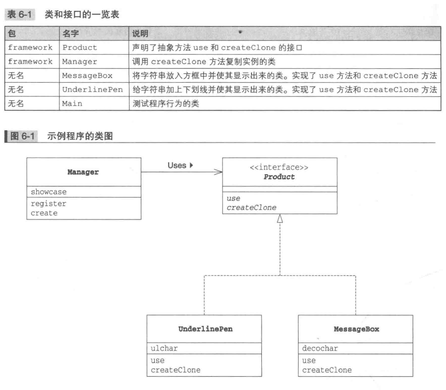
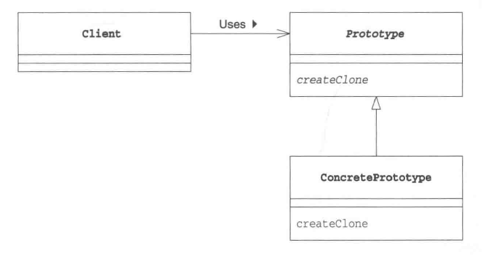

# Prototype Pattern

_Oct 26, 2019_

## 1. Introduction

在开发的过程中我们经常使用 new 关键字来创建实例，但有的时候我们需要 **在不指定类名的前提下生成实例**。例如在以下情况中，我们就需要根据现有的实例来生成新的实例：

1. 对象种类繁多，无法将他们整合到一个类中

   > 即无法将所有对象整合到同一个类中，也无法对于每种对象都新建一个类。

2. 难以根据类生成实例

   > 即当生成实例的过程太过复杂，很难根据类来生成实例。

3. 想要解耦框架和生成的实例

   > 因为想要让生成实例的框架不依赖于具体的类，于是要先注册一个原型实例，再通过复制该实例来生成新的实例。

在JAVA中，可以使用clone来创建instance的副本，所以这里主要学习clone与Cloneable接口的应用。

## 2. Example



```java
package framework;

public interface Product extends Cloneable {
    public abstract void use(String s);
    public abstract Product createClone();
}

public class Manager {
    private HashMap showCase = new HashMap();
    public void register(String protoName, Product proto) {
        showcase.put(protoName, proto);
    }
    public Product create(String protoName) {
        Product p = (Product)showcase.get(protoName);
        return p.createClone();
    }
}
```

在这里的例子中, Manager class 负责注册每个 `<prototype name, prototype instance>` 对，然后 create 方法则可以根据不同对 protoName 来通过复制 proto instance 的方法创建新的实例。而 User 则需要提供具体的实现了 Product 接口的类的实现 （MessageBox class， UnderlinePen class），这些类需要实现 `createClone()` 方法，这个方法的实现大致如下：

```java
  public class MessageBox implements Product {
      // ....

      public Product createClone() {
          Product p = null;
          try {
              p = (Product)clone();
          } catch (CloneNotSupportedException e) {
              e.printStackTrace();
          }
          return p;
      }
  }
```

需要注意的是，`clone()` 方法默认情况下是 protected 的，如果没有将其 override 为 public，是不可以在此类以外调用的。所以我们在类的外面调用 `createClone()` 方法，再类的内部实现这个方法时调用 `clone()` 方法。

这样，在使用的时候，我们可以这样做：

```java
public class Main {
    public static void main(String[] args) {
        Manager manager = new Manager();
        MessageBox mbox = new MessageBox('*');
        manager.register("warning box", mbox);

        // 调用 createClone 根据 “warning box” protoName 生成新的 instance
        Product p1 = manager.create("warning box");
        p1.use("hello world");

        //...
    }
}
```

MessageBox 类和 UnderlinePen 类则可以拥有多种不同的field（可以由构造函数传入）来使用不同的字符对输出字符串进行分割处理。也就是说，同一个类（`MessageBox`）的不同instance可以因为其中不同的field而使得 `use(String s)` 方法具有不同的 behavior。

## 3. Prototype Pattern 中的角色



1. Prototype 原型

   > 该角色负责定义用于复制现有实例生成新实例的方法，在示例中，由Product接口扮演。

2. Concrete Prototype 具体原型

   > 负责实现复制现有实例生成新实例的方法，由 MessageBox class 和 UnderLinePen class 担任。

3. Client 使用者

   > 负责使用复制实例生成新实例的方法，在示例中由 Manager 担任。

## 4. 拓展思路

### i. 不能根据类名来生成实例吗

1. 对象种类繁多，无法整合到一个类中

   > 例如此处例子中的 Product，每种实现了 Product 接口的 class 都可以有各自不同的属性，用于接下来对传入 `use(String s)` 的字符串的输出处理。如果我们通过类名创建实例，势必需要对每个不同的field都写一个class，这是不现实的。即使我们只使用同一个类 \(例如使用 MessageBox class\)，我们如果手动创建实例，也需要每次手动处理创建实例的步骤（例如此处需要将不同的分隔符传入constructor）。

2. 难以根据类生成实例

   > 假设我们要生成一个和用户通过一系列手表操作创建出来的实例完全一样的实例，显然根据实例的clone来生成实例比根据类直接生成实例更加简单。

3. 想要解耦框架与生成的实例

   > 在 Manager class 的 create 方法中，我们不需要使用类名，而是使用了 “warnning box” 之类的字符串为生成的实例命名。这样具有了更好的通用性，将框架从类名的束缚中解脱出来了。

### ii. 类名是束缚吗

面向对象编程的目标之一就是 **作为组件复用**，在代码中一旦出现类名就无法与该类再分离开来，也就无法实现对与其他类的复用。

## 5. 相关设计模式

1. Flyweight Pattern

   > 使用Protype模式可以生成一个与当前实例状态完全相同的实例；而使用 FLyweight 模式可以在不同的地方使用同一个实例。

2. Memento Pattern

   > 使用 Memento 模式可以保存当前实例的状态，以实现快照和撤销功能。

3. Composite Pattern 以及 Decorator Pattern

   > 经常使用 Composite Pattern 和 Decorator Pattern 时需要能动态创建复杂结构的实例，这时可以使用 Prototype 模式。

4. Command Pattern

   > 想要复制 Command 模式中出现的命令时，可以使用 Protype 模式。

## 6. 延伸，关于clone and Cloneable Interface

1. clone 方法定义在 Object 中，所以所有class都继承了 clone 方法
2. 只有实现了 Cloneable 接口或者其父类实现了 Cloneable 接口的类可以调用 clone，否则会抛出异常。
3. Cloneable 接口并不声明 clone 方法，只是用来标记 **可以使用clone方法**，这样的接口被称为 “**标记接口（marker interface）**”。
4. clone 方法进行的是浅拷贝（shallow copy）。如果需要深拷贝或者需要被复制的field需要调用构造函数，则需要自己实现clone方法。

