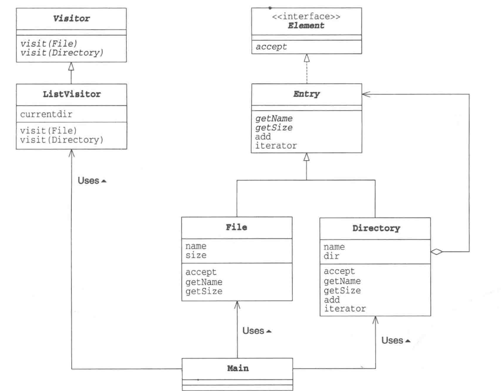

# Visitor Pattern
_update Mar 21, 2020_

----
## 1. Instruction
Visitor模式的目的是将**数据结构**和**处理方法**分离开来，这样当我们需要增加对数据结构对操作时就只需要编写新的访问者，然后让数据结构接受新的访问者。

## 2. Example


```java
// Visitor的base class，根据每个具体的element声明visit方法，稍后被element在accept中调用
public abstract class Visitor {
    public abstract void visit(File file);
    public abstract void visit(Directory directory);
}

public interface Element {
    public abstract void accept(Visitor v);
}

public abstract Entry implements Element {
    public abstract String getName();
    public abstract int getSize();
    public Iterator iteraotr();
    public String toString();
}

// 在Element子类Directory和File中的accept的实现都是这样：
// 这样做之后，就可以call到visitor中针对这个具体类的object “this” 的visit 方法
    public void accept(Visitor v) {
        v.visit(this);
    }

public class ListVisitor extend Visitor {
    private String currentDir = "";
    public void visit(File file) {
        System.out.println(currentDir + "/" + file);
    }
    public void visit(Directory directory) {
        System.out.println(currentDir + "/" + directory);
        String savedDir = currentDir;
        currentDir += "/" + directory.getName();
        Iterator it = directory.iterator();
        while (it.hasNext()) {
            Entry entry = (Entry) it.next(); // up cast, no overhead
            entry.accept(this); // 会递归调用visit
        }
        currentDir = savedDir; // backtrack
    }
}
```

事实上在Visitor Pattern中对于数据结构的访问是由数据结构的类来主导的，在上面的例子中，对于数据结构操作的入口其实是 `Element.accept(Visitor v)`，而调用这个方法只是为了在 `Visitor.visit(Element e)` 中传入具体的 Element 的 subclass 的 instance，由此调用正确的对应这个具体类的visit方法，并且避免主动的type checking 以及 casting。

## 3. Visitor Pattern 中的角色
* ### 1. Visitor
负责对数据结构中每个具体角色（ConcreteElement T）声明一个`visit(T)`方法

* ### 2. ConcreteVisitor
负责实现Visitor角色所定义的API，对于每个ConcreteElement的具体操作在visit方法中实现，在其中可以存储状态，随着visit处理的进行，其中的状态可以发生变化，就像上面例子中的currentDir。

* ### 3. Element
表示Visitor访问的对象，声明了accept方法，接受参数为Visitor。

* ### 4. ConcreteElement
实现了具体的accept方法，call visit方法，并将自身的指针传入。

* ### 5. ObjectStructure
负责处理Element的集合，在例子中由Directory扮演。具体的，例如当我们iterate一个directory下的所有File和次级Directory时，我们需要递归调用子结构的accept方法。

## 4. 思考
感觉在之前学习过的设计模式中Vistor Pattern是属于相对令人费解的，我觉得在复习的时候需要注意如下几点：

* ### 1. 避免type checking and casting
考虑到数据结构类会有hierarchy，那么在处理的时候如果拿到的只是Base Class类型的引用，我们免不了需要在**处理方法**的类中检查类型以及cast，因为这样会影响性能并且引入更多的强耦合。而Visitor Pattern则可以避免这样的问题，因为通过在Visitor class中为每个具体的数据结构的类declare不同的visit方法，而在每个具体data structure的类中实现accept方法，将自身this指针pass到visitor的visit方法，通过这种方法，就可以利用overload调用到正确的visit方法，而不需要任何的type check and cast。

* ### 2. Double Dispatch（双重分发）
```java
    element.accept(visitor);
    visitor.visit(element);
```
这样的调用构成了双重分发，即ConcreteElement和ConcreteVisitor这两个具体的类的instance共同决定了实际进行的处理。

* ### 3. 体现了Open/Closed Principle


## 5. 相关设计模式
