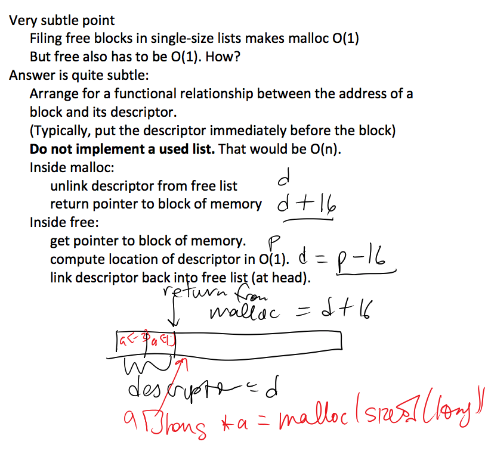

# Memory Management

_2017-11-14 23:18:54_

## Memory 的作用

1. **Internal tables:**  
   1. **File descriptors:** Describe how to communicate with devices;
   2. **Process/thread descriptors:** Describe how to run a process;
   3. **Semaphores and mutexes:** Describe the locations of shared memory;
   4. **File cache:** Describe what is on disk;
2. **Application memory:**
   1. **private:** for this application only;
   2. **shared:** \(e.g., between threads\);
   3. **copy on write:** when forking;

## Tiers of memory:


## 命名

   
 **Page:** page 是 process's view of the memory;  
**Frame:** frame 是 os's view of the memory;

## The life cycle of logical memory:


## Malloc:


### --&gt; Malloc 的行为\(理解\)

Malloc 记录两个结构：现在正在使用的block的description以及可以被重用的block的description。为了简便，理解为 **free list** 和 **used list**；

**当调用 malloc 时**，如果 free list 中存在一个足够大的block的descriptor，则把这个descriptor 从 free list 中移动到 used list 中，并将指针返回。如果没有，就向操作系统要更多内存。

**当调用 free 时**，在 used list 中找到 block's descriptor，将其放入 free list；

**Effectively：** 所有之前已经 freed 的内存可以直接被 malloc 继续分配。所以只需要在free list 中的 descriptor 不够的时候才会 call sbrk（to add another page）；

## The buddy System:

这里有一篇文章讲得很好：[http://blog.csdn.net/vanbreaker/article/details/7605367](http://blog.csdn.net/vanbreaker/article/details/7605367);

### --&gt; Buddy system descriptors:

```c
  struct descriptor {
      struct descriptor *next;
      void *memory;
  } descriptors[TABLESIZE], *free[POWERS];
```

### --&gt; How buddy system work:

  

**总结：**

* You ask for m bytes;
* Malloc actually hands out blocks of 2^p - 16;
* Where actual size is such that 2^\(p-1\) - 16 &lt; m &lt; 2^p - 16;
* The first 16 bytes say: 
  1. block 的长度（2 的幂次方）；
  2. free list 中的 next pointer；

### --&gt; 题点

1. 注意对于给定大小需求时，实际分配内存大小的推断；
2. 注意每次malloc所返回的指针之前的16bytes位descriptor，而这个位置是可以被 write over 的，所以如果 free 修改后descriptor的地址，就会 segmentation fault；

